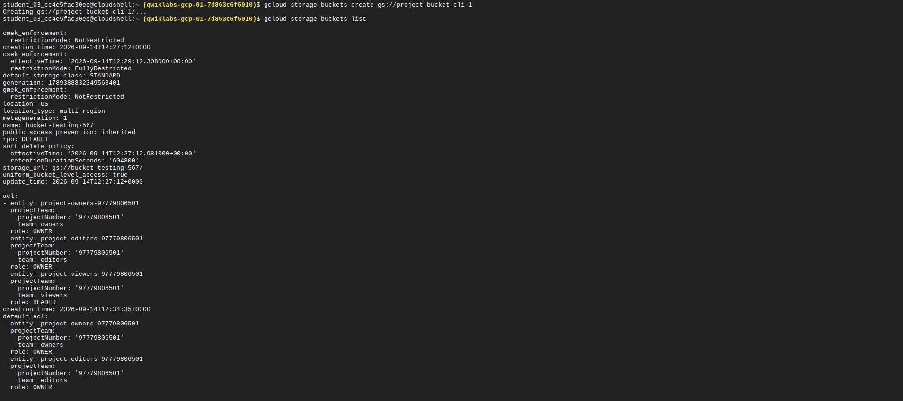
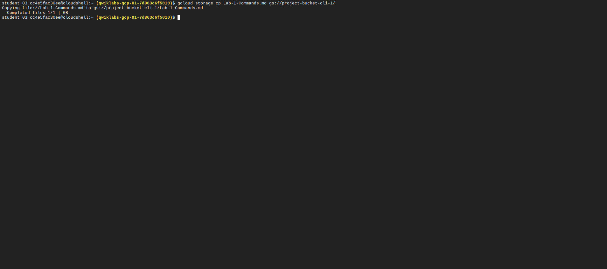
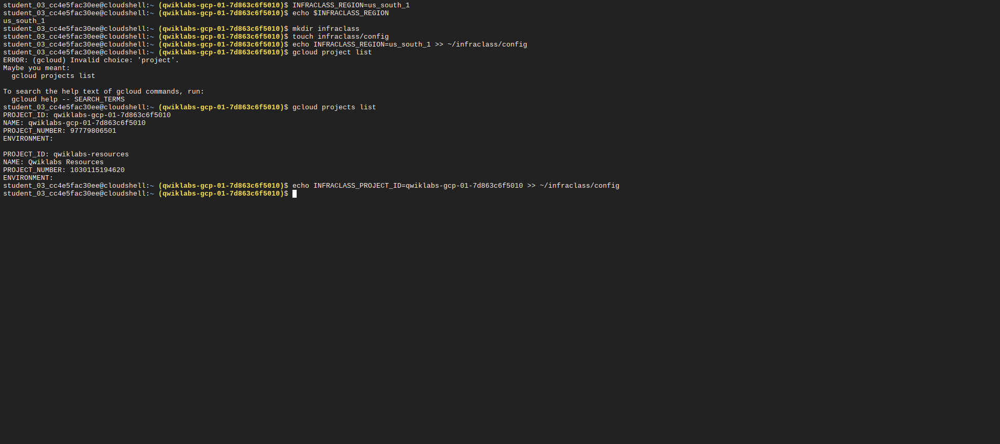
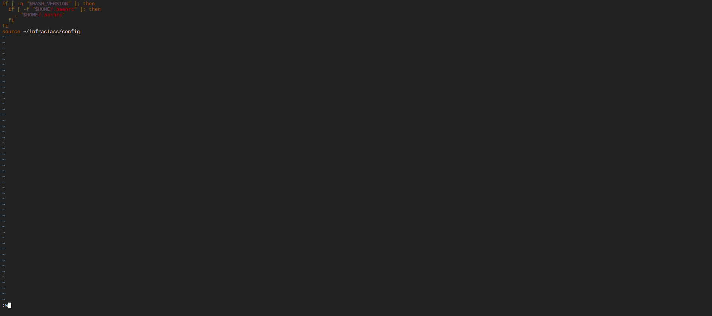
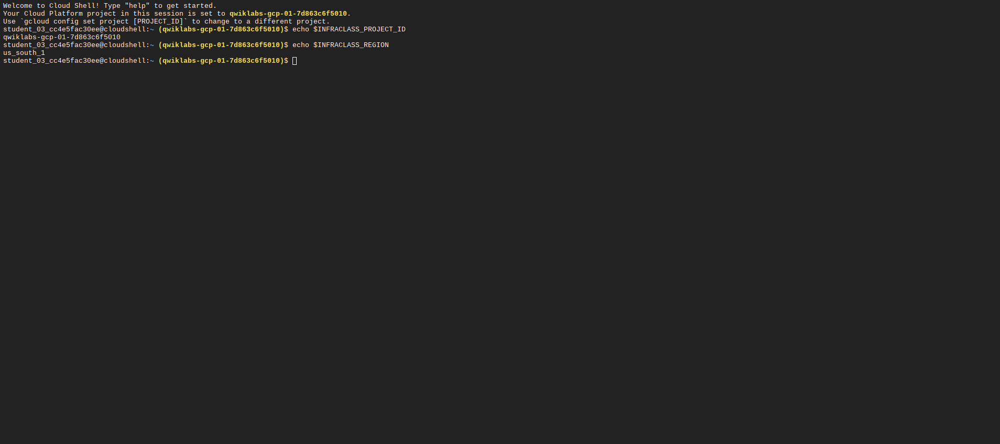
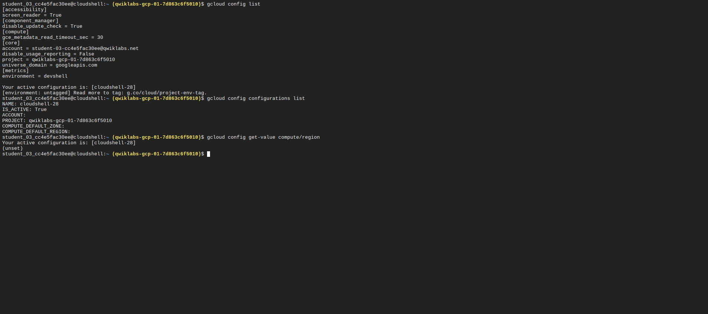
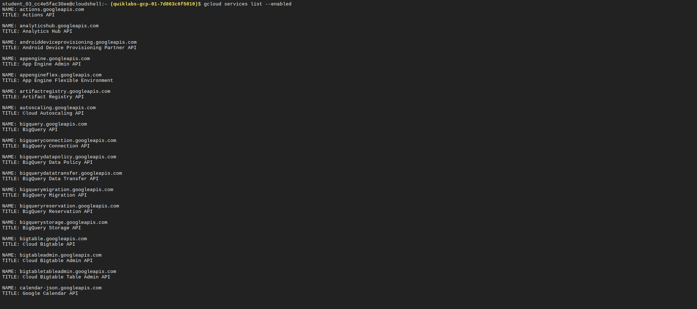

# Lab 01 - Explore the Google Cloud Console and Cloud Shell

**Google Skills lab:** CBL006  
**Main services:** Cloud Storage, Cloud Shell, Google Cloud CLI

## Objective

The objective of this lab was to use both Google Cloud administration interfaces.

I used the Google Cloud console to create resources. I then used Cloud Shell and `gcloud` to create, inspect, and manage resources from the command line.

I also configured persistent shell values and performed a deliberate failure test.

## Skills Practiced

| Skill | Work completed |
| --- | --- |
| Google Cloud console | Created and inspected Cloud Storage buckets |
| Cloud Shell | Used the browser-based shell and Google Cloud CLI |
| `gcloud storage` | Created buckets and copied objects |
| `gcloud config` | Inspected the active Google Cloud configuration |
| Service discovery | Listed enabled Google Cloud services |
| Shell configuration | Stored project and region values in a configuration file |
| Shell persistence | Loaded the configuration from `.profile` |
| Troubleshooting | Tested a command against a non-existent resource and then verified the active context |

## 1. Create and List Cloud Storage Buckets

I created Cloud Storage buckets with the Google Cloud console and Cloud Shell.

I used the CLI to list the available buckets and verify that the resources were present.

```bash
gcloud storage buckets create gs://BUCKET_NAME
gcloud storage buckets list
```



### Key point

The Google Cloud console and `gcloud` manage the same Google Cloud resources. The console provides a graphical interface. The CLI provides direct command-line control and supports automation.

## 2. Copy a File to Cloud Storage

I uploaded a file to Cloud Shell. I then copied the file to a Cloud Storage bucket.

```bash
gcloud storage cp FILE_NAME gs://BUCKET_NAME
```



This task showed the difference between the temporary Cloud Shell VM and Cloud Storage. The local file existed in the Cloud Shell environment. The copied object existed in the Cloud Storage bucket.

## 3. Set a Region Value

I listed the available Compute Engine regions and selected a region for the lab.

```bash
gcloud compute regions list
INFRACLASS_REGION=REGION_NAME
echo $INFRACLASS_REGION
```


The variable reduced repeated typing in later commands.

## 4. Save Configuration Values

Cloud Shell can replace the temporary VM after a session ends. I stored the project and region values in a file under the persistent home directory.

```bash
mkdir -p ~/infraclass
touch ~/infraclass/config

echo INFRACLASS_REGION=$INFRACLASS_REGION >> ~/infraclass/config
echo INFRACLASS_PROJECT_ID=$INFRACLASS_PROJECT_ID >> ~/infraclass/config
```



I loaded the saved values with `source`.

```bash
source ~/infraclass/config
```

## 5. Load the Configuration at Shell Startup

I added the configuration file to `.profile`.

```bash
source ~/infraclass/config
```



After I reopened Cloud Shell, I checked the stored project value.

```bash
echo $INFRACLASS_PROJECT_ID
```



### Key point

The Cloud Shell VM is temporary. The home directory is persistent. A startup file such as `.profile` can load saved shell configuration when a new shell starts.

## 6. Inspect the Active `gcloud` Configuration

I checked the active Google Cloud CLI configuration.

```bash
gcloud config list
gcloud config get-value project
gcloud config configurations list
```



This check is important before an administrator changes resources. It confirms the active project and configuration.

## 7. Inspect Enabled Google Cloud Services

I listed the services that were enabled for the current project.

```bash
gcloud services list --enabled
```



Google Cloud services use APIs. A project can require the relevant API before a service can be used.

## 8. Perform a Deliberate Failure Test

I intentionally referenced a bucket that did not exist.

```bash
gcloud storage ls gs://NON_EXISTENT_BUCKET
```


I then checked the active identity and project context.

```bash
gcloud auth list
gcloud config get-value project
```


This test reinforced a basic troubleshooting sequence:

```text
Read the error
    ↓
Check the resource name
    ↓
Check the active identity
    ↓
Check the active project
    ↓
Check permissions and service availability
```

## Commands Used in This Lab

```bash
# Identity and project context
gcloud auth list
gcloud config list
gcloud config get-value project
gcloud config configurations list

# Regions
gcloud compute regions list

# Cloud Storage
gcloud storage buckets create gs://BUCKET_NAME
gcloud storage buckets list
gcloud storage cp FILE_NAME gs://BUCKET_NAME
gcloud storage ls gs://BUCKET_NAME

# Google Cloud services
gcloud services list --enabled

# Shell configuration
source ~/infraclass/config
echo $INFRACLASS_PROJECT_ID
echo $INFRACLASS_REGION
```

## Lab Result

I completed the lab with both the Google Cloud console and Cloud Shell. I created Cloud Storage resources, transferred an object, inspected the active CLI configuration, checked enabled services, configured persistent shell values, and tested a failed resource lookup.

The next labs will extend this repository with Compute Engine, VPC networking, IAM, monitoring, logging, and infrastructure administration tasks.
